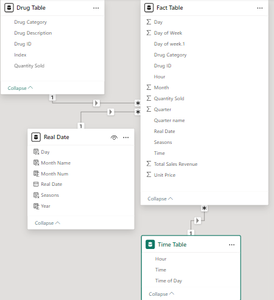
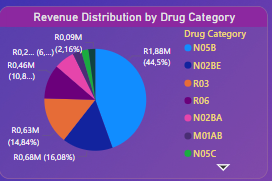
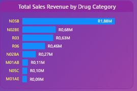
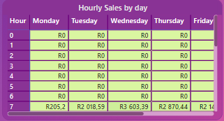
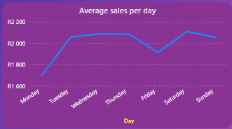
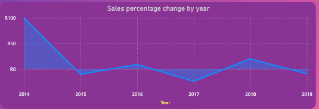

# Pharmaceutical Sales Analysis

This repository showcases a comprehensive analysis of sales data from a Pharmaceutical company.Through this project, I applied my skills in data transformation, data modeling, and visualization using **Power BI** and **Power Query**, focusing on the ETL process to derive meaningful business insights.

## 📋 Table of Contents

- [Introduction](#introduction)
- [Problem Statement](#problem-statement)
- [Data Sourcing](#data-sourcing)
- [Data Transformation (ETL Process)](#data-transformation-etl-process)
- [Data Model Design](#data-model-design)
- [Exploratory Data Analysis (EDA)](#exploratory-data-analysis-eda)
- [Tools Used](#tools-used)
- [Dashboard Visualizations](#dashboard-visualizations)
- [Interactive Dashboard Download](#interactive_dashboard_download)
- [Conclusion and Insights](#conclusion-and-insights)
- [Next Steps](#next-steps)

# Introduction

When I came across the dataset for Pharmaceutical Sales Data, I was instantly intrigued by its extensive and intricate nature. As an individual keen on honing my expertise in data cleaning, analysis, and visualization, this dataset presents a perfect opportunity for me to immerse myself and enhance my abilities.

# Problem Statement

- Which pharmaceutical drugs consistently sell the most and the least over the past six years?
- How does the sales performance of the pharmacy evolve over time? Are there any noticeable trends or patterns?
- What is the distribution of sales across different drug categories? Which category contributes the highest share of sales?
- Are there specific months or seasons when the pharmacy experiences significant increases or decreases in sales?
- Is there a correlation between the sales of specific drugs and external factors such as advertising campaigns, promotions, or seasonal events?

# Data Sourcing

The dataset consists of pharmaceutical transactional data collected over a period of 6 years (2014-2019), stored in a CSV file. It includes information on the date, time, pharmaceutical drug brand name, and quantity sold. The dataset comprises 57 drugs classified into different therapeutic categories based on the Anatomical Therapeutic Chemical (ATC) Classification System.

Sourced from the Point-of-Sale system used by the pharmacy, the CSV file provides a rich source of information for analysis. The goal is to analyze the sales data of these pharmaceutical drugs and gain insights that can help improve business performance and drive growth for the Pharmacy.

##  Data Transformation (ETL Process)

The data transformation process focused on ensuring high data quality before analysis. Using **Power Query**, I performed the following ETL tasks:

### Extract
- Loaded raw transactional data directly from the pharmacy's Point-of-Sale system into Power BI.

### Transform
- **Data Cleaning**:
  - Removed records with missing or null values in critical fields (e.g., date, drug name).
  - Corrected data types for accurate analysis (e.g., date, text, integer).
  - Standardized drug brand names for consistency.
- **Feature Engineering**:
  - Extracted key date components (year, month, day) to enable trend analysis.
  - Created new calculated columns such as `TotalSalesRevenue` and `TimeOfDay` for more granular analysis.
- **Categorization**:
  - Mapped drugs into their respective ATC therapeutic categories for enhanced analysis.

### Load
- Loaded the cleaned and transformed dataset into Power BI for visualization and further analysis.

# Data Model Design

### 📸 Data Model Snapshot:

## Overview

The data model is a crucial part of any data analysis or reporting process. In this project, we have used a **Star Schema** to structure the data. A Star Schema is widely used in data warehousing for its simplicity and efficiency in data retrieval, especially in analytical environments. The central component of the model is the **Fact Table**, which contains the transactional data, and it connects to various **Dimension Tables**, which contain descriptive or categorical data.

This design allows for flexible, high-performance querying and makes it easier to analyze different aspects of the data. Below is a detailed explanation of the data model and the relationships between the tables.

## Tables and Relationships

### Fact Table (`fact_table`)

The **Fact Table** serves as the center of the data model. It contains transactional data, such as sales, usage, or other metrics related to the business. In this model, the **Fact Table** stores entries with the following key attributes:
- **Drug ID**: Identifies the specific drug.
- **Hour**: The time at which the transaction occurred.
- **Real Date**: The specific date when the transaction took place.

### Dimension Tables

The **Dimension Tables** provide descriptive information about the metrics stored in the **Fact Table**. Each dimension table is linked to the **Fact Table** using a specific key, creating the relationships that allow for meaningful analysis. In this design, the following Dimension Tables are used:

1. **Drug Table (`drug_table`)**
   - Contains detailed information about each drug, such as its name, category, manufacturer, and other attributes.
   - **Key Column**: `Drug ID`, which links to the **Fact Table**.

2. **Time Table (`time_table`)**
   - Contains time-related information such as the hour of the day, day of the week, month, and year.
   - **Key Column**: `Hour`, which links to the **Fact Table**.

3. **Real Date Table (`real_date_table`)**
   - Contains calendar-related information such as the actual date, week number, month, quarter, and year.
   - **Key Column**: `Real Date`, which links to the **Fact Table**.

## Relationships Between Tables

### 1. **Fact Table → Drug Table**
   - The relationship between the **Fact Table** and the **Drug Table** is based on the **Drug ID**.
   - In the **Fact Table**, each entry corresponds to a specific drug, and the **Drug ID** field in the **Fact Table** is linked to the **Drug ID** field in the **Drug Table**.
   - **Cardinality**: This relationship is a **Many-to-One** relationship, meaning many entries in the **Fact Table** (representing multiple transactions) are related to a single entry in the **Drug Table** (representing one drug).
   - **Reasoning**: This relationship allows the data to be aggregated and analyzed by different drug characteristics (e.g., drug category, manufacturer).

### 2. **Fact Table → Time Table**
   - The relationship between the **Fact Table** and the **Time Table** is based on the **Hour** field.
   - Each transaction in the **Fact Table** has an associated time, and the **Hour** field in the **Fact Table** is linked to the **Hour** field in the **Time Table**.
   - **Cardinality**: This is a **Many-to-One** relationship, where many records in the **Fact Table** (representing multiple transactions) relate to a single record in the **Time Table** (representing one specific hour of the day).
   - **Reasoning**: This allows the analysis of transactions across different time periods, such as hours of the day, weekdays, etc.

### 3. **Fact Table → Real Date Table**
   - The relationship between the **Fact Table** and the **Real Date Table** is based on the **Real Date** field.
   - In the **Fact Table**, each transaction is associated with a specific date, and the **Real Date** field in the **Fact Table** links to the **Real Date** field in the **Real Date Table**.
   - **Cardinality**: This is a **Many-to-One** relationship, meaning multiple records in the **Fact Table** can correspond to a single date in the **Real Date Table**.
   - **Reasoning**: This relationship allows for analysis over time, where you can aggregate data by day, week, month, quarter, or year.

## Data Model Schema: Star Schema

In a Star Schema, the **Fact Table** sits at the center, and all related **Dimension Tables** surround it. This model is designed to facilitate fast query performance, especially in analytics, by minimizing the number of joins required. The relationships are clear and straightforward, allowing for intuitive data exploration.

- The **Fact Table** contains the measures (e.g., sales, quantity, etc.), while the **Dimension Tables** provide context to those measures.
- The **Fact Table** is connected to each **Dimension Table** via a foreign key, which corresponds to the primary key of the related dimension.
- This setup enables users to easily filter, group, and analyze the data by any dimension (e.g., by drug, by time, by date).

## Why Star Schema?

The **Star Schema** was chosen for this data model for the following reasons:
1. **Simplicity**: The schema is simple to understand and easy to implement, making it ideal for quick reporting and analysis.
2. **Performance**: The Star Schema reduces the number of joins between tables, which improves query performance, especially when working with large datasets.
3. **Flexibility**: It allows users to slice the data across multiple dimensions, making it versatile for different types of analysis.
4. **Scalability**: As the dataset grows, the Star Schema remains efficient, and new dimensions can be easily added to the model.

## Summary

This data model is structured to provide efficient and scalable analysis by organizing the data into a central **Fact Table** and related **Dimension Tables**. The relationships between the tables allow for easy filtering, aggregation, and exploration of the data, making it suitable for various business intelligence tasks.

- The **Fact Table** holds transactional data such as drug usage, time of transaction, and date.
- The **Dimension Tables** provide descriptive details about the drugs, time, and dates, enabling the analysis to be done from different perspectives.
- The relationships between the tables are set up as **Many-to-One**, ensuring that each record in the Fact Table corresponds to a single record in each Dimension Table.

This model provides a strong foundation for performing meaningful analysis and deriving insights from the data.

##  Exploratory Data Analysis (EDA)

The analysis phase involved exploring the cleaned dataset to gain insights into sales patterns. Key questions explored include:

- **Top-Selling and Least-Selling Drugs**: Identified the best and worst-performing drugs over the six-year period.
- **Sales Trends Over Time**: Analyzed sales performance by year, month, and season.
- **Category Sales Distribution**: Evaluated the contribution of each drug category to total sales.
- **Peak Sales Periods**: Determined peak sales hours and days of the week.

## Tools Used

- **Power BI**: Used for visualizing and creating interactive dashboards to analyze the sales data.
- **Power Query**: Used for data transformation and cleaning, including merging tables, filtering, and shaping data for analysis.
- **Excel**: Initially used for exploratory analysis and data validation.
- **DAX (Data Analysis Expressions)**: Utilized for creating custom calculations and measures in Power BI, such as Total Sales and Average Sales per Day.

## Dashboard Visualizations

1. **Revenue Distribution by Drug Category**:
   - This pie chart shows the **revenue share** for each drug category.
   - **Key Insight**: The **N02BE/B** category generates the highest revenue, dominating sales, which should be a focus for stocking and promotions.
   
   

2. **Sales by Drug Category**:
   - This column chart illustrates **sales performance** by drug category over time.
   - **Key Insight**: This allows for identifying strong-performing categories and those that may need further attention in marketing and stock management.
   
   

3. **Hourly Sales Heatmap**:
   - The heatmap displays **sales data by hour** of the day.
   - **Key Insight**: **Afternoons and evenings** experience the highest traffic, while late hours are quieter. This is important for optimizing staffing and store hours.

   

4. **Average Sales Per Day of the Week**:
   - This line chart shows the **average sales per day** for each day of the week.
   - **Key Insight**: Peak sales occur on **Tuesdays, Wednesdays, and Saturdays**, while Mondays see the lowest sales.
   - **Recommendation**: Optimize staffing on peak days and consider promotions on quieter days (Monday and Thursday) to boost sales.

   

5. **Percentage Change in Sales Revenue by Year**:
   - This line chart highlights **year-over-year sales growth**, showing trends from 2014 to 2019.
   - **Key Insight**: There's a noticeable **decline from 2014 to 2015**, followed by a recovery in 2018, and a decrease in 2019. Identifying the causes behind these changes is key for future planning.

   

##  Interactive Dashboard Download

You can download the Power BI dashboard file (.pbix) using the link below:

[Download Pharmaceutical Sales Dashboard (.pbix)](PBI/Pharmaceutical_Sales_Dashboard.pbix)

  ## Conclusion and Insights

Based on the analysis of the various visualizations, the following insights and recommendations are made:

- **Staffing and Resource Allocation**: Adjust staffing schedules based on peak sales times (afternoons and evenings). Ensure adequate coverage during quieter periods.
- **Targeted Promotions**: Run promotions during quieter hours (late hours and Mondays/Thursdays) to increase traffic and sales.
- **Inventory Management**: Focus on stocking high-demand drugs, particularly those in the **N02BE/B** category, based on revenue and sales performance.
- **Sales Trends**: Continue to track and analyze year-over-year performance to spot further opportunities for growth or areas that need improvement.

The dashboard provides a solid foundation for data-driven decision-making to optimize operations and sales performance at Mary’s Pharmacy.

## Next Steps

1. **Implement Recommendations**: Put into practice the strategies suggested based on the dashboard insights.
2. **Monitor Results**: Continue tracking sales and operational metrics, adjusting strategies as needed.
3. **Ongoing Analysis**: Further explore data for deeper insights into drug-specific performance, seasonal trends, and potential correlations with external events or promotions. 

